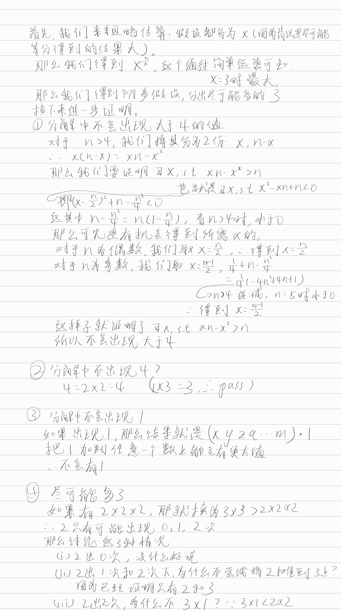

其实这就是一个rod-cutting的问题。
首先，我们来看两者的区别：
rod-cutting中我们选择从左边开始一个个遍历所有可能的最左边切割部分的长度。然后用其乘以剩下钢条的最优值。这样子就能遍历所有的情况。那么为什么我们要从边上开始切呢？这是因为，在中间切一部分（假设长度为k）下来的话，剩下的左右两部分（假设长度为a和b）是不能合在一起直接求dp[a+b]的。
在这个题目中，我们不一定要从边上开切，我们可以直接选择一个值（假设是k）。那么即使我们在中间切下来，我们可以将两边的部分加在一起获得a+b。然后可以直接求dp[a+b]
由此，我们可以看出，这道题目是rod-cutting的简化版。
~~其实并不是这样的，这题和rod-cutting还有区别：rod-cutting中dp[i]是将**i**作为一个整体也考虑进去的，而这道题的dp[i]没有将**i**这个值也考虑进去。~~（其实rod-cutting也将总长度考虑进去了，在rod-cutting中我们也是要考虑一个长度和将这个长度切分之后的价值之间的大小的。但是两者之间有一个致命的区别，假使rod总长为i，且price[i]就是最大的可能性，那么我们可以直接取rod的长度为i，不进行划分。但是在这道题中，如果不划分，那么结果就是0）


## 第一次提交

1. 我没有考虑到这道题目还需要比较一个数本身的大小和其分解的乘积的大小。

```c++
class Solution {
public:
    int integerBreak(int n) {
        int *dp=new int[n+1];
        dp[0]=0;
        dp[1]=1;

        if(n==0)
            return 0;
        if(n==1)
            return 1;
        for(int i=2;i<=n;i++)
        {
            dp[i]=dp[i-1];
            for(int j=1;j<=i-1;j++)
            {
                if(j*dp[i-j]>dp[i])
                {
                    dp[i]=j*dp[i-j];
                }
            }
        }
        return dp[n];
    }
};
```

## 第二次提交

我直接将dp[i]=i;作为初始条件了，因为我想的是反正都要比较整个长度和分解后乘积的大小。但是这里就是和rod-cutting不一样的地方了。rod-cutting就算总长度为i，如果长度为i的价值最大，我们也可以直接取i。而这里是不行的，不如n=2.

```c++
class Solution {
public:
    int integerBreak(int n) {
        int *dp=new int[n+1];
        dp[0]=0;
        dp[1]=1;

        if(n==0)
            return 0;
        if(n==1)
            return 1;
        for(int i=2;i<=n;i++)
        {
            dp[i]=i;
            for(int j=1;j<=i-1;j++)
            {
                if(j*dp[i-j]>dp[i])
                {
                    dp[i]=j*dp[i-j];
                }
            }
        }
        return dp[n];
    }
};
```

### 第三次提交

成功

```c++
class Solution {
public:
    int integerBreak(int n) {
        int *dp=new int[n+1];
        dp[0]=0;
        dp[1]=1;

        if(n==0)
            return 0;
        if(n==1)
            return 1;
        for(int i=2;i<=n;i++)
        {
            dp[i]=dp[i-1];
            for(int j=1;j<=i-1;j++)
            {
                if(j*dp[i-j]>dp[i]||j*(i-j)>dp[i])
                {
                    if(j*dp[i-j]>j*(i-j))
                    {
                        dp[i]=j*dp[i-j];
                    }
                    else
                    {
                        dp[i]=j*(i-j);
                    }
                }
            }
        }
        return dp[n];
    }
};
```

## 第四次提交

使用数学方法。

**我一开始用的是3^beki，但是C++中^并不代表阶乘的意思。**

```c++
class Solution {
public:
    int integerBreak(int n) {
        if(n ==0)
        {
            return 0;
        }
        if(n==1||n==2)
        {
            return 1;
        }
        if(n==3)
        {
            return 2;
        }
        if(n==4)
        {
            return 4;
        }
        int beki=n/3;
        int red=n%3;
        if(red==0)
        {
            return pow(3,beki);
        }
        else if(red ==1)
        {
            beki=(n-4)/3;
            return (pow(3,beki))*4;

        }
        else{
            beki=(n-2)/3;
            return pow(3,beki)*2;
        }
    }
};
```




## 第五次提交

在这一次提交中，我将判断n mod 3的条件判断直接取消了。

在while(n>=5)中，循环结束时，n的可能值为2，3，4。这分别对应n mod 3=2，0，1。这样子代码就比较清爽。

<font color=red>**但是问题在于这样子就不是O(1)而是O(logn)了，所以还是不行**</font>

```c++
class Solution {
public:
    int integerBreak(int n) {
        if(n==0)
        return 0;
        if(n==1)
        return 1;
        if(n==2)
        return 1;
        if(n==3)
        return 2;
        if(n==4)
        return 4;
        int result=1;
        while(n>=5)
        {
            result*=3;
            n-=3;
        }
        return result*=n;
    }
};
```

